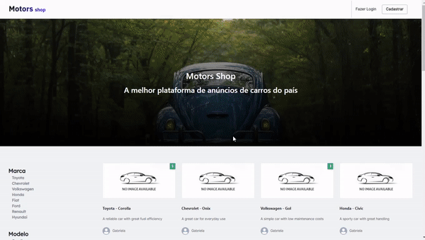

# Kenzie Kars

Site de e-commerce voltado para compra de carros em geral.

<p align="center">
    
</p>

---

# Instalação

### Pré-requisitos

- (opcional) Ter [VS Code](https://code.visualstudio.com/download) instalado

### Passo-a-passo

1. Instalar as dependências.

```
npm install
```

2. Rodar o servidor local.

```
npm run dev
```